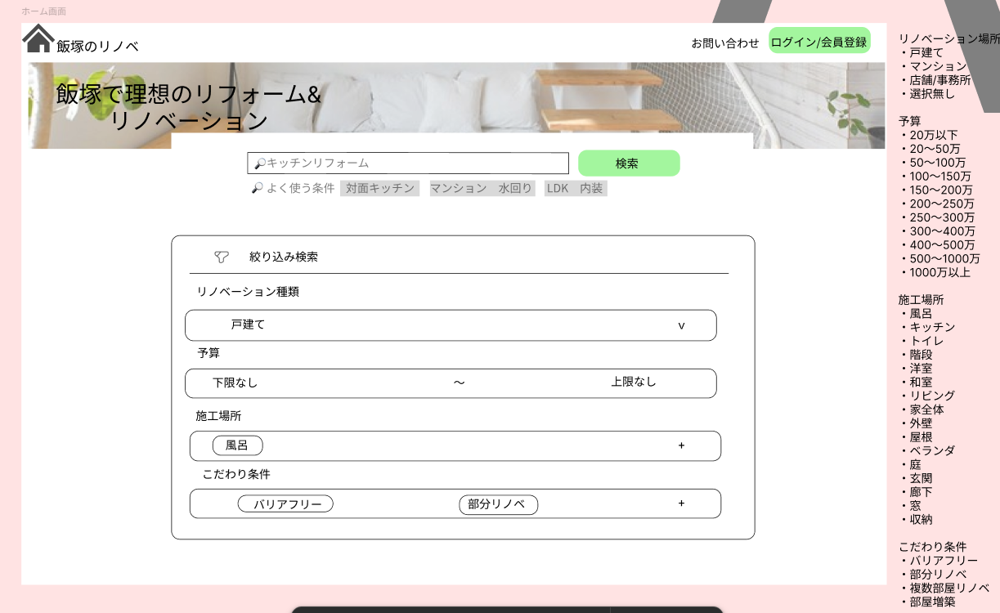
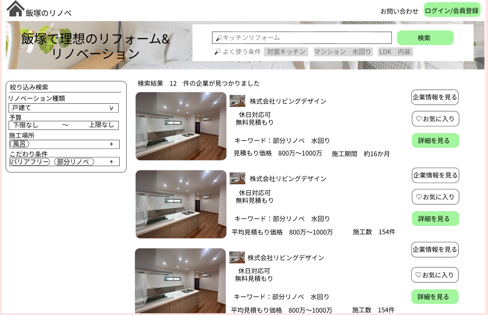
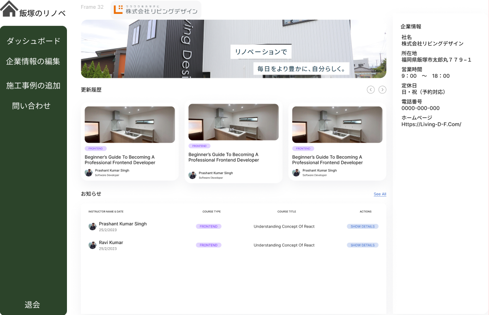
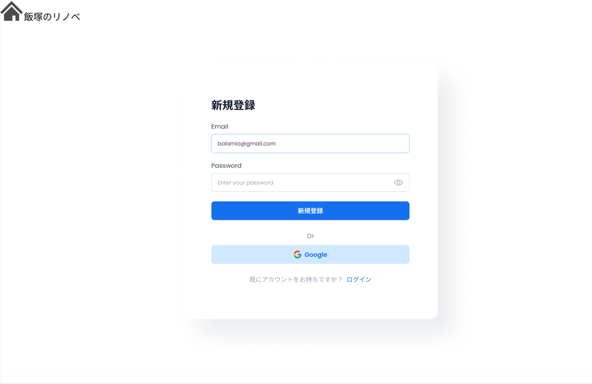
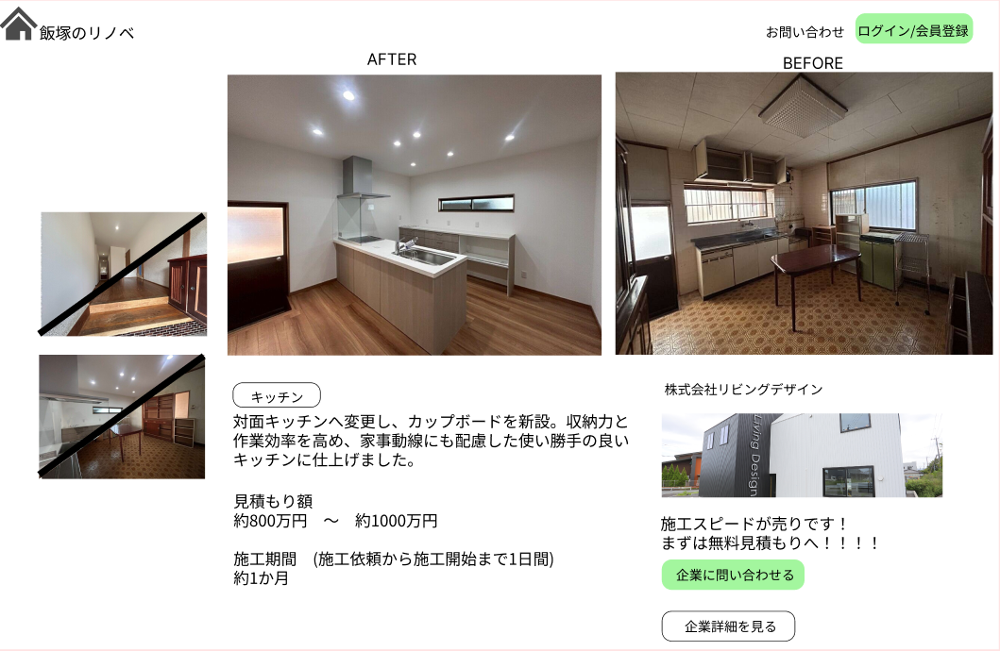
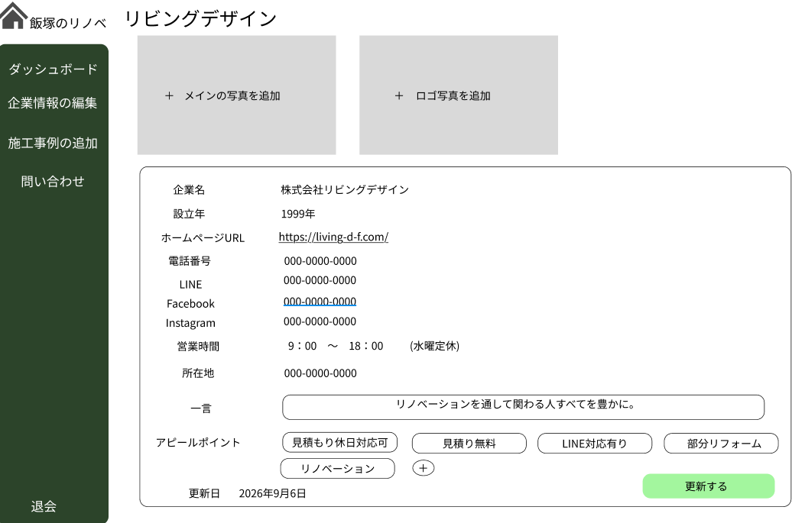
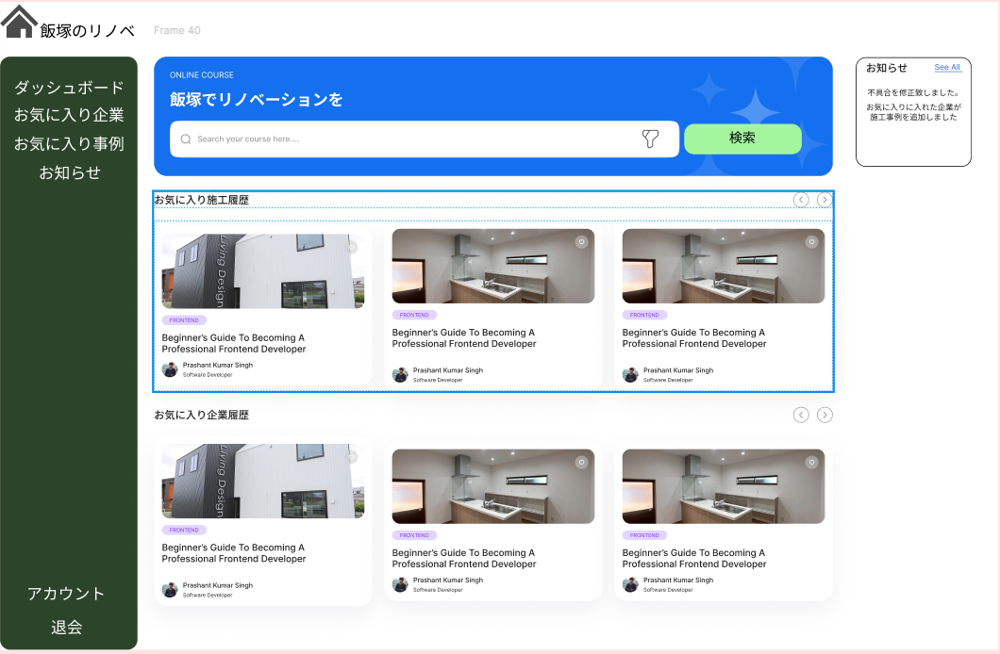
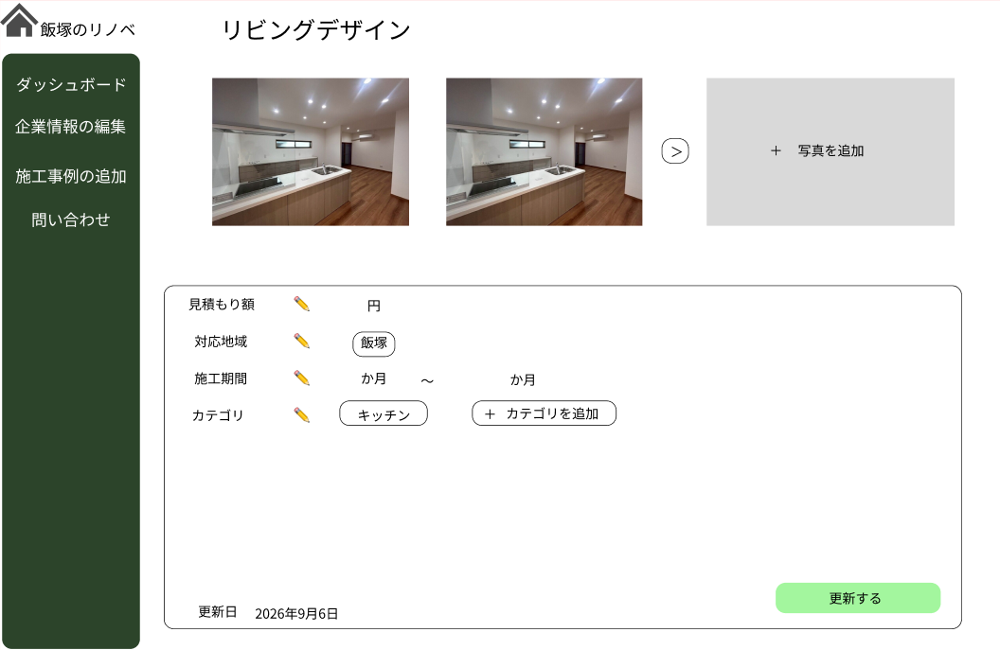
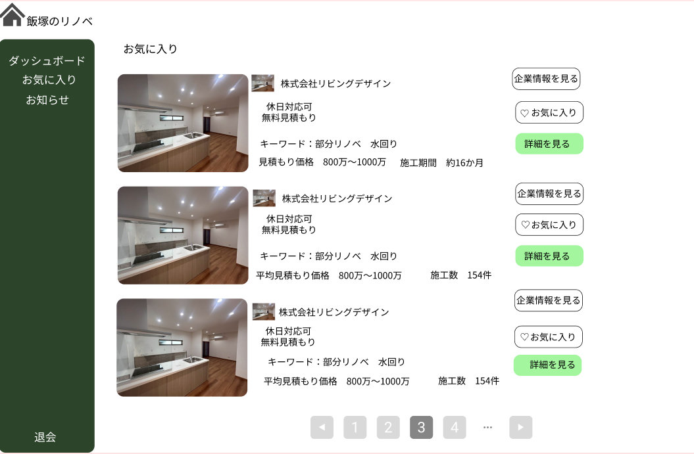
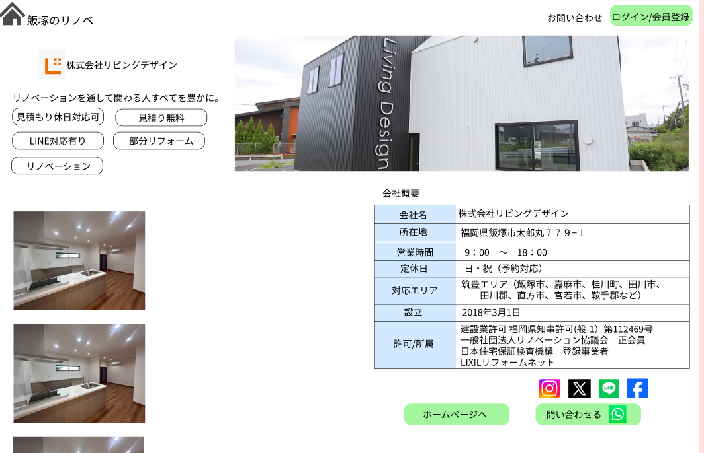

## 画面設計

ここでは画面設計についてメモを記載しています。
あくまで大枠の画面設計なので、色や構成の細かい修正は行う予定です。

## ユーザーについて
ユーザーとして、一般アカウントと企業アカウントを準備します
企業アカウントは一般アカウントに企業権限を付与したアカウントです。

## 各ページの設計

### ホーム

### 検索／検索結果

### 企業側のダッシュボード

### ログインページ／アカウント作成ページ

### 検索結果詳細

### 企業情報編集ページ

### ユーザー側のダッシュボード

### 施工事例編集ページ

### ユーザーのお気に入り一覧

### 企業詳細ページ

